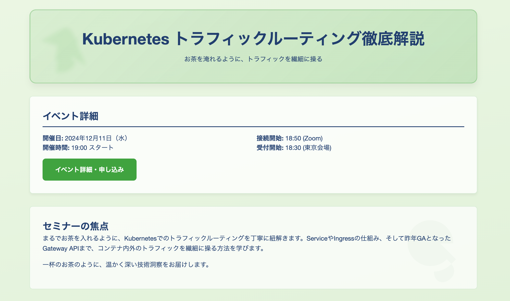
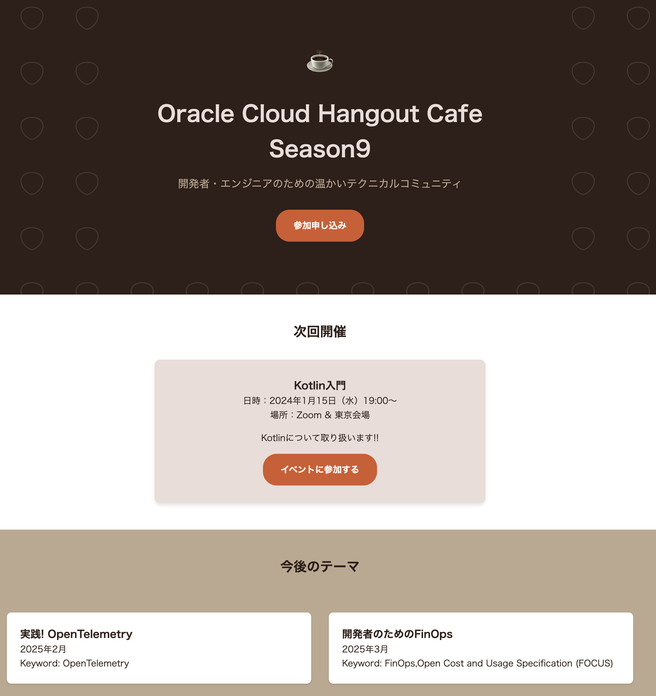

# Oracle Hangout Cafe Season 9 #3 Kubernetes トラフィックルーティング徹底解説

## ディレクトリ構成

```sh
.
├── README.md
├── app　-> サンプルHTMLページ
│   ├── Dockerfile
│   ├── cafe
│   │   └── index.html
│   ├── default.conf
│   └── ocha
│       └── index.html
├── externaldns　-> externalDNS関連のManifest
│   └── externaldns.yaml
├── gateway -> Gateway API関連のManifest
│   ├── app.yaml
│   └── gateway.yaml
├── ingress -> Ingress関連のManifest
│   ├── app.yaml
│   └── ingress.yaml
└── issuer -> Issuer関連のManifest
    └── issuer.yaml
```

## 前提条件

- 環境はOCI Kubernetes Engineを利用
- OCIリソースの認可方式は[インスタンスプリンシパル](https://docs.oracle.com/ja-jp/iaas/Content/Identity/Tasks/callingservicesfrominstances.htm)を利用
- 利用可能なドメインを保有していること

## 環境構築(OKE)

OKEのプロビジョニングは[こちら](https://oracle-japan.github.io/ocitutorials/cloud-native/oke-for-commons/)を参考に実施してください。
Worker NodeのスペックはVM.Standard.E5.Flexシェイプで2oCPU、16GB RAM × 3 Nodeで作成してください。

## Ingress

### Namespaceの作成

```sh
kubectl create ns ocha-ingress-demo
```

### ExternalDNSのデプロイ

ExternalDNSをデプロイします。

```yaml
apiVersion: v1
kind: ServiceAccount
metadata:
  name: external-dns
  namespace: kube-system
---
apiVersion: rbac.authorization.k8s.io/v1
kind: ClusterRole
metadata:
  name: external-dns
rules:
  - apiGroups:
      - ""
    resources:
      - services
      - endpoints
      - pods
      - nodes
      - namespaces
    verbs:
      - get
      - watch
      - list
  - apiGroups:
      - extensions
      - networking.k8s.io
    resources:
      - ingresses
    verbs:
      - get
      - list
      - watch
  - apiGroups:
      - gateway.networking.k8s.io
    resources:
      - gateways
      - httproutes
      - tlsroutes
      - tcproutes
      - udproutes
    verbs:
      - get
      - watch
      - list
---
apiVersion: rbac.authorization.k8s.io/v1
kind: ClusterRoleBinding
metadata:
  name: external-dns-viewer
roleRef:
  apiGroup: rbac.authorization.k8s.io
  kind: ClusterRole
  name: external-dns
subjects:
  - kind: ServiceAccount
    name: external-dns
    namespace: kube-system
---
apiVersion: apps/v1
kind: Deployment
metadata:
  name: external-dns
  namespace: kube-system
spec:
  strategy:
    type: Recreate
  selector:
    matchLabels:
      app: external-dns
  template:
    metadata:
      labels:
        app: external-dns
    spec:
      serviceAccountName: external-dns
      containers:
        - name: external-dns
          image: registry.k8s.io/external-dns/external-dns:v0.15.0
          args:
            - --source=gateway-httproute
            - --source=ingress
            - --log-level=debug
            - --provider=oci
            - --policy=create-only
            - --txt-owner-id=my-identifier
            - --oci-zone-scope=
            - --oci-auth-instance-principal
            - --oci-compartment-ocid=ocid1.compartment.oc1..aaaaaaaaxxxxxxxxxzgunm3ivkwfmlvfoscnamvmrzgdq　<- ご自身のコンパートメントOCIDに変更
```

適用します。

```sh
kubectl apply -f externaldns/
```

以下のリソースが作成されれば問題ありません。  

```sh
kubectl get deploy external-dns -n kube-system
NAME           READY   UP-TO-DATE   AVAILABLE   AGE
external-dns   1/1     1            1           16d
```

### Ingressの作成

#### レポジトリのclone

```sh
git clone https://github.com/oracle/oci-native-ingress-controller
```

#### Ingress Controllerのインストール

Ingress Controllerのインストールは[こちら](https://github.com/oracle/oci-native-ingress-controller/blob/main/GettingStarted.md)を参考に実施してください。

インストールされると、以下のリソースが作成されます。  

```sh
kubectl get all -n native-ingress-controller-system
NAME                                                 READY   STATUS    RESTARTS     AGE
pod/oci-native-ingress-controller-569c6984dc-hbkxw   1/1     Running   3 (9d ago)   11d

NAME                                    TYPE        CLUSTER-IP     EXTERNAL-IP   PORT(S)   AGE
service/oci-native-ingress-controller   ClusterIP   10.96.27.236   <none>        443/TCP   16d

NAME                                            READY   UP-TO-DATE   AVAILABLE   AGE
deployment.apps/oci-native-ingress-controller   1/1     1            1           16d

NAME                                                       DESIRED   CURRENT   READY   AGE
replicaset.apps/oci-native-ingress-controller-569c6984dc   1         1         1       11d
replicaset.apps/oci-native-ingress-controller-84869d8dcd   0         0         0       16d
```

#### Ingressリソースの作成

`ingress/ingress.yaml`のパラメータを変更します。  

```yaml
apiVersion: "ingress.oraclecloud.com/v1beta1"
kind: IngressClassParameters
metadata:
  name: native-ic-params
  namespace: ocha-ingress-demo
spec:
  compartmentId: "ocid1.compartment.oc1..aaaaaaaaw4afdnptxxxxxxxxxxxxxxxkwfmlvfoscnamvmrzgdq" <-この値をご自身のコンパートメントに変更
  subnetId: "ocid1.subnet.oc1.ap-tokyo-1.aaaaaaaabftxncd5nxxxxxxxxxxn4j3eaey7xmk5fqcxomfea" <-この値をOKEプロビジョニングに作成されたLoadBalancerサブネットのOCIDに変更
  loadBalancerName: "native-ic-lb"
  isPrivate: false
  maxBandwidthMbps: 10
  minBandwidthMbps: 10
```

適用します。

```sh
kubectl apply -f ingress/ingress.yaml
```

以下のようにIngressリソースが表示されていれば問題ありません。（`ADDRESS`が表示されるまでは時間がかかる場合があります）

```sh
kubectl get ingress -n ocha-ingress-demo
NAME                  CLASS                     HOSTS                 ADDRESS        PORTS   AGE
ocha-simple-ingress   native-ic-ingress-class   ingress.ochacafe.jp   138.2.31.146   80      35h
```

### サンプルWebページのデプロイ

簡単に作成したWebページをデプロイします。  

Manifestを編集します。  

```yaml
apiVersion: networking.k8s.io/v1
kind: Ingress
metadata:
  name: ocha-simple-ingress
  namespace: ocha-ingress-demo
  annotations:
    oci-native-ingress.oraclecloud.com/healthcheck-port: "80"
spec:
  ingressClassName: native-ic-ingress-class
  rules:
    - host: "ingress.ochacafe.jp" <- ご自身が利用可能なドメインに変更
      http:
        paths:
          - path: /ocha
            pathType: Prefix
            backend:
              service:
                name: ocha
                port:
                  number: 80
          - path: /cafe
            pathType: Prefix
            backend:
              service:
                name: ocha
                port:
                  number: 80
  defaultBackend:
    service:
      name: ocha
      port:
        number: 80
```


```sh
kubectl apply -f ingress/app.yaml
```

以下のURLでブラウザからアクセスしてみます。

- http://<設定したドメイン>/ocha/



- http://<設定したドメイン>/cafe/



## Gateway API

### NGINX Gateway Fabricのインストール

```sh
kubectl kustomize "https://github.com/nginxinc/nginx-gateway-fabric/config/crd/gateway-api/standard?ref=v1.5.0" | kubectl apply -f -
```

```sh
kubectl apply -f https://raw.githubusercontent.com/nginxinc/nginx-gateway-fabric/v1.5.0/deploy/crds.yaml
```

```sh
kubectl apply -f https://raw.githubusercontent.com/nginxinc/nginx-gateway-fabric/v1.5.0/deploy/default/deploy.yaml
```

以下のリソースが作成できていれば問題ありません。

```sh
kubectl get pods -n nginx-gateway
NAME                             READY   STATUS    RESTARTS   AGE
nginx-gateway-7f7748c4d9-nr94g   2/2     Running   0          6d1h
```

### Issuerのインストール

```sh
kubectl apply -f issuer/
```

以下のようになっていれば問題ありません。

```sh
kubectl get issuer -n ocha-gateway-demo
NAME             READY   AGE
letsencrypt-gw   True    38h
```

### Gateway APIリソースのインストール

Manifestのパラメータを編集します。  

```yaml
apiVersion: gateway.networking.k8s.io/v1
kind: Gateway
metadata:
  name: gateway
  namespace: ocha-gateway-demo
  annotations:
    cert-manager.io/issuer: letsencrypt-gw
spec:
  gatewayClassName: nginx
  listeners:
    - name: http
      hostname: gateway.ochacafe.jp <- ご自身が利用可能なドメインに変更
      port: 80
      protocol: HTTP
      allowedRoutes:
        namespaces:
          from: All
    - name: https
      hostname: gateway.ochacafe.jp <- ご自身が利用可能なドメインに変更
      port: 443
      protocol: HTTPS
      allowedRoutes:
        namespaces:
          from: All
      tls:
        mode: Terminate
        certificateRefs:
          - name: gw-secret
            namespace: ocha-gateway-demo
            kind: Secret
            group: ""
---
apiVersion: gateway.networking.k8s.io/v1
kind: HTTPRoute
metadata:
  name: ocha
  namespace: ocha-gateway-demo
spec:
  hostnames:
    - gateway.ochacafe.jp <- ご自身が利用可能なドメインに変更
  parentRefs:
    - name: gateway
      sectionName: https
  rules:
    - matches:
        - path:
            type: PathPrefix
            value: /ocha
      backendRefs:
        - name: cafe
          port: 8080
---
apiVersion: gateway.networking.k8s.io/v1
kind: HTTPRoute
metadata:
  name: cafe
  namespace: ocha-gateway-demo
spec:
  hostnames:
    - gateway.ochacafe.jp <- ご自身が利用可能なドメインに変更
  parentRefs:
    - name: gateway
      sectionName: https
  rules:
    - matches:
        - path:
            type: PathPrefix
            value: /cafe
      backendRefs:
        - name: cafe
          port: 8080
```

リソースを適用します。

```sh
kubectl apply -f gateway/gateway.yaml
```

### サンプルWebページのデプロイ

簡単に作成したWebページをデプロイします。  

```sh
kubectl apply -f gateway/app.yaml
```

Ingressと同様のWebページが表示されます。

- http://<設定したドメイン>/ocha/

- http://<設定したドメイン>/cafe/
